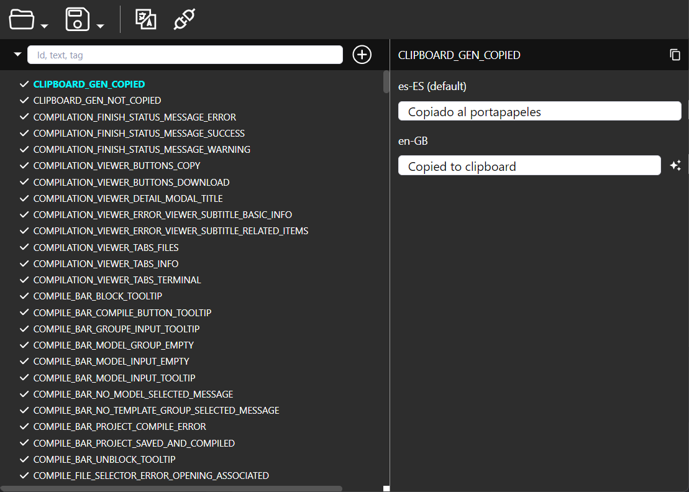

# Kandeta

A powerful desktop translation management application built with Electron, React, and TypeScript. Kandeta streamlines the localization workflow for developers and translators by providing an intuitive interface for managing translation files, automated translation services, and real-time collaboration features.

## 📸 Preview



*Kandeta's intuitive interface showing the translation list on the left and the editing panel on the right, with real-time search and filtering capabilities.*

## 📥 Download

### Latest Release - v1.1.0

#### Windows

[](downloads/v1.1.0/win/kendeta-1.1.0-setup.exe)

**Size: ~94 MB** | **Requirements: Windows 10 or later**

> 💡 **Easy Installation**: Just download and run the setup file. The installer will guide you through the process.

#### macOS

[](downloads/v1.1.0/mac/)

Run `npm run build:mac` to build for macOS

#### Linux

[](downloads/v1.1.0/linux/)

Run `npm run build:linux` to build for Linux

### 📁 All Releases

Browse all available versions and platforms: **[Downloads](downloads/)**

---

## ✨ Features

- **Multi-format Support**: Work with JSON separated files and other translation formats
- **Smart Translation Management**: Create, edit, rename, and duplicate translations with ease
- **Automated Translation**: Integrate with Claude AI and Google Translate for automated translations
- **Advanced Filtering**: Search and filter translations by ID, text content, or custom tags
- **Real-time Updates**: Auto-scroll to newly created translations with instant feedback
- **Project Management**: Organize translations by projects with import/export functionality
- **Developer-Friendly**: Built with modern web technologies and extensible architecture

## 🚀 Quick Start

### Prerequisites

- Node.js (v18 or higher)
- npm or yarn package manager

## 📦 Installation & Setup

### Install Dependencies

```bash
npm install
```

### 🛠️ Development

Start the development server with hot reload:

```bash
npm run dev
```

### 📱 Usage

1. **Create a New Project**: Start by creating or opening a translation project
2. **Import Translation Files**: Load your existing JSON translation files
3. **Manage Translations**: Use the intuitive interface to create, edit, and organize translations
4. **Filter & Search**: Quickly find specific translations using the built-in search and filter system
5. **Auto-Translate**: Leverage AI-powered translation services for faster workflow
6. **Export Results**: Save your translations back to your preferred file format

### 🏗️ Building for Production

```bash
# Build for Windows
npm run build:win

# Build for macOS
npm run build:mac

# Build for Linux
npm run build:linux
```

## 🧰 Development Tools

### Recommended IDE Setup

- [VSCode](https://code.visualstudio.com/) + [ESLint](https://marketplace.visualstudio.com/items?itemName=dbaeumer.vscode-eslint) + [Prettier](https://marketplace.visualstudio.com/items?itemName=esbenp.prettier-vscode)

### Code Quality

```bash
# Run linter
npm run lint

# Type checking
npm run typecheck

# Format code
npm run format
```

## 👨‍💻 For Developers

Interested in contributing or extending Kandeta? Check out our comprehensive developer documentation:

**📖 [Developer Documentation](DEVELOPER.md)**

The developer guide includes:
- Detailed project architecture
- Component structure and patterns
- How to add new features and translation services
- Development workflow and best practices
- Contribution guidelines

## 📄 License

This project is open source and available under the [MIT License](LICENSE).

## 🤝 Contributing

We welcome contributions! Please see our [Developer Documentation](DEVELOPER.md) for detailed information about the development process, architecture, and how to submit improvements.

## 🐛 Issues & Support

If you encounter any issues or have questions:
- Check the [existing issues](https://github.com/Bovedano/kandeta/issues)
- Create a [new issue](https://github.com/Bovedano/kandeta/issues/new) with detailed information
- Refer to the [Developer Documentation](DEVELOPER.md) for technical details

---

**Made with ❤️ for the developer and translator community**
